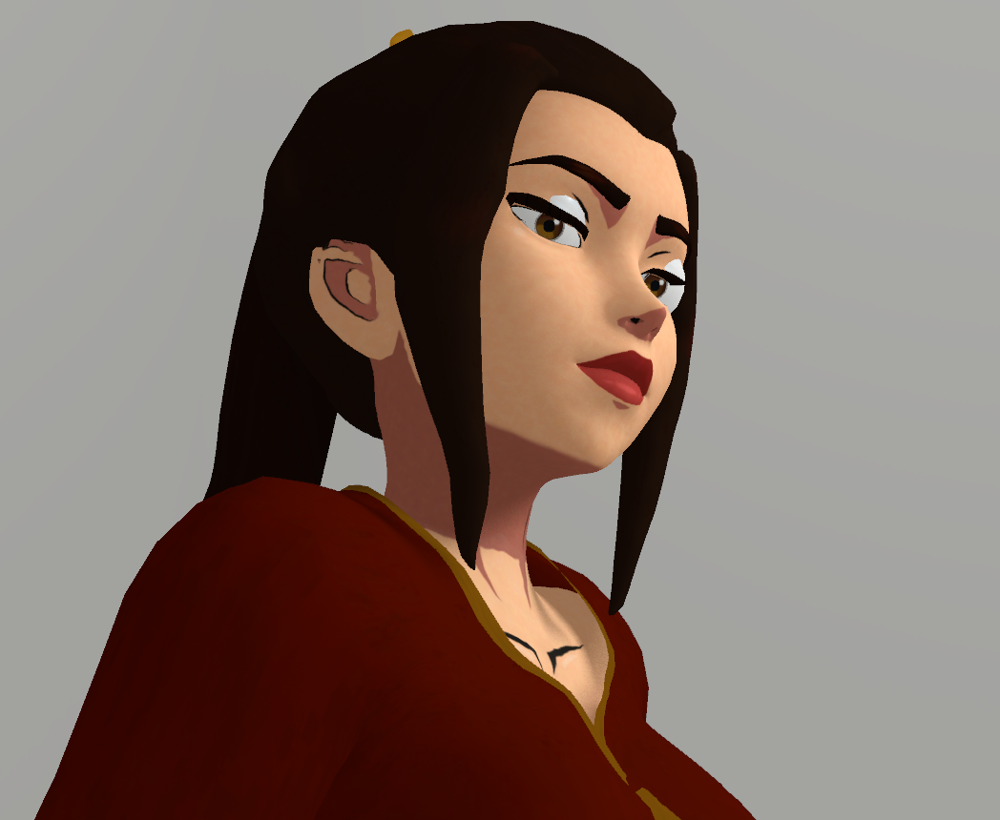

# VamEyeScroller

The DAZ3D characters used by Virt-A-Mate have spherical eyes. The models are designed to rotate to look at things, and there are several material options to fine-tune the look of every part of the eye. However, in a lot of stylized models the character's eyes are too big and flat for this to work properly, and if you try it you will have nightmares for weeks. Artists use a technique called UV scrolling where the textures are scrolled along the eye model surface, giving the illusion of the character looking in a different direction.  

So we have a problem. We can't have giant dinnerplate eyes sticking out of our waifu's skulls during sexytime, that just won't do. That's where VamEyeScroller comes in!
Apply this plugin to your character and feed it an AssetBundle containing the original model's eye geometry and materials, and the plugin will handle the rest.


This plugin is used for replacing the spherical, transform-based eyes used by the DAZ G2F
model with static UV-scroll-based eyes common in stylized models.

## Why would I need this?

Does your character ever look at you like this?


Well I have news for you! If your original character model came with UV-scrolling eyes before you ported it to VAM, you can use them!

# Walkthrough

The length of this document might look a bit daunting, but if you've made AssetBundles for VAM before you'll breeze through it.

For the sake of clarity, whenever I mention "eye model/mesh" I am talking about the models that came with the original character, not the G2 eyes unless
explicitly stated otherwise.

If your eye model is symmetric, I suggest only using one eye for the Retargeting step and duplicating/mirroring the model once we get to setting up the Unity prefab.
Otherwise, do whatever you want. At the end of the day, as long as you're in Unity and each eye has its own GameObject in the prefab, everything should be fine.

## Getting your eyes into an AssetBundle

### Retargeting Eyes Origin

- Load your eye model into DAZ. It should be aligned properly and look normal, apart from some clipping with the G2 eyes.
- When the eye is in place, export the G2 model __AND__ eye model as an FBX.
- Import the FBX into blender with the `Armature > Automatic Bone Orientation` enabled. The bones will be messed up, but don't worry.
- Select the armature and enable `Object Data Properties (green stickman tab icon) > Viewport display > In Front`
- Enter pose mode (ctrl+tab with armature selected), select all bones (a) and reset all transforms (alt+g, alt+r, alt+s).
- Select the Head bone base and `Snap Cursor to Selected` You should be able to search for this (and following commands) by pressing space.
- Enter Object mode (ctrl+tab), select the eye model.
- `Origin to 3D Cursor`
- `Cursor to World Origin`
- `Selection to Cursor`
- At this point, the eye model should be somewhere at the character's feet.
- If your eyes are together as one object, separate them now. We need them as two separate GameObjects in Unity later.
- With only the eye models selected, export them as FBX with the `Limit to: Selected Objects` and `Transform > Apply Transform` options enabled, and we'll head over to Unity.

### Importing into Unity

 If you don't have an AssetBundle exporter project set up yet or you just want to make sure you're doing things right, 
 follow [MacGruber's tutorial](https://hub.virtamate.com/resources/unity-assetbundles-for-vam-1-xx.167/) (NSFW, duh).
 
- Once we're in Unity, we need to make sure some of the import settings are set properly for our mesh.
  - Read/Write Enabled - __THIS IS IMPORTANT!__ If you don't enable this, the plugin won't be able to modify the UVs.
  - AssetBundle - Choose a name for the file you're going to export. Note that we'll be appending the `.assetbundle` suffix to the end of whatever name you use here.
- Import your eye texture(s) and set the following import settings. 
  - Wrap Mode "Clamp" - This will stop the texture from tiling across the eye if it gets too small or travels off the side too far.
  - AssetBundle - same bundle as before.
- Create a material for your eyes.
  - Set the AssetBundle
  - Use the standard shader for now, the plugin will transfer the textures to the Sclera VAM material.
Worst case is that you get a severe case of pink eye if the shader is missing. Fill in the material with your eye textures and change the options as you would in a regular Unity game.

### Exporting as an AssetBundle

- Let's make a prefab. Create a new Empty GameObject in the hierarchy and reset its transform. This will be our root GameObject. Feel free to call it something interesting.
- Drag your eye meshes into the scene as children of the root GameObject, and reset their transforms too.
  - If you only have one eye mesh at this point, duplicate it now and change its `Scale.x` to -1.
- At this point, you should have a root GameObject that has two child GameObjects; one for each eye. The child GameObjects should have MeshFilter and MeshRenderer components.
- Apply the material you made earlier to both these child GameObjects.
- __THIS IS IMPORTANT:__ rename your child objects in the hierarchy so that they have the suffix `.l` and `.r` respectively.
- Your hierarchy should look something like this:
```
root
|   eye.l
|   eye.r
```
note: the words "root" and "eye" in the example can be any names you like. The `.l` and `.r` suffix is mandatory.
- Save the prefab by dragging the root GameObject from the hierarchy into the Project panel and give it an interesting name.
- Set the prefab's AssetBundle.
- We're ready to export the bundle from Unity! As a quick sanity check, let's go over all the important pieces we should have in our AssetBundle.
  - Eye texture(s)
  - Eye material
  - Eye mesh(es)
  - Prefab
- Export your AssetPack now. If you're not sure how, I again refer you to MacGruber's tutorial.

## Setting up the plugin

- Add the plugin `VamEyeScroller.cs` to your Person atom and open the Custom UI.
- Browse for your AssetBundle
- Click "Active". If you set up the bundle correctly, the "Valid Setup" box should turn green and have a check mark.
And we're done! The G2 eyes should be replaced with static, UV-scrolling eyes.

## Calibrating your eyes

Calibrating the eyes is easiest if you set the Person's `Auto Behaviours > Eye Control > Eyes Look At` to Player.
- Tweak the Z Bone Offset to get the eyes seated in the sockets _just right_.
- If the character isn't looking straight at you when your camera is directly in front, tweak the U and V "Iris Offset" values.
- If one of the eyes is tracking the opposite direction, change the "Mirror one eye" option.
- If both of the eyes are tracking in the wrong direction, change the U value to negative.
- Move the camera around the edges of the character's field of view until they _just_ stop tracking. Change the U and V "Values Per Rotation" until the irises are pointing towards the camera.
- Finally, if you want the character to track even further to the sides, have a play with some of the other options in `Auto Behaviours` to increase or decrease the eye angle limits.

## License

[GNU GPLv3](LICENSE.md)
